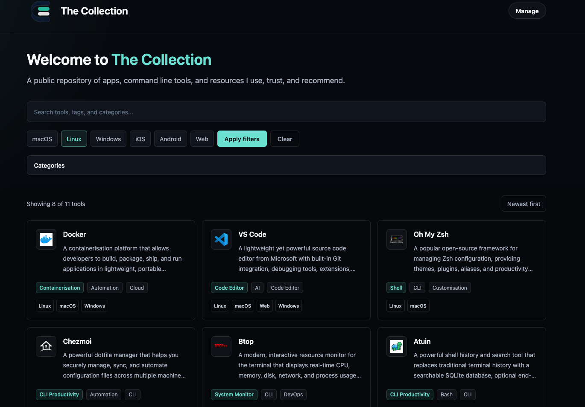

# The Collection

## Introduction

The Collection is a public catalogue of recommended apps, command line tools, and resources.

It gives visitors a simple way to browse published tools by search, platform, category, and tags. The private owner-only admin area is used to add, edit, draft, publish, and delete tools without exposing unpublished entries to the public site.



## Features

- Browse a public catalogue of recommended tools and resources.
- Search tools by name, description, tags, platform, and category.
- Filter published tools by platform and category.
- Manage tools through a private owner-only admin area.
- Upload or link tool logos and keep uploaded files in persistent storage.

## Stack

- Node.js 22
- Next.js App Router
- TypeScript
- Tailwind CSS
- Prisma
- SQLite
- Authentik OIDC for owner-only admin sign-in
- Docker and Docker Compose
- GitHub Container Registry
- GitHub Actions

## Requirements

Before running this project, install:

- Node.js 22
- npm
- Docker and Docker Compose, for container testing or server deployment
- OpenSSL, for generating a local session secret

## Configuration (.env)

1. Create a local `.env` file from the example file:

    ```bash
    cp .env.example .env
    ```

2. Update `.env` with values for your local setup:

    ```bash
    APP_URL=http://127.0.0.1:3000
    AUTHENTIK_ISSUER=https://auth.example.com/application/o/the-collection/
    AUTHENTIK_CLIENT_ID=replace-with-authentik-client-id
    AUTHENTIK_CLIENT_SECRET=replace-with-authentik-client-secret
    AUTHENTIK_ADMIN_EMAIL=nathan@autonate.dev
    SESSION_SECRET=replace-with-a-long-random-string
    DATABASE_URL=file:./data/the-collection.db
    DATA_DIR=./data
    OPENROUTER_API_KEY=replace-with-openrouter-api-key
    ```

3. Generate a session secret:

    ```bash
    openssl rand -base64 48
    ```

Environment notes:

- `APP_URL` is the public base URL for the site. In production, use the deployed HTTPS URL.
- `AUTHENTIK_ISSUER` is the Authentik application issuer URL, usually `https://auth.example.com/application/o/<application-slug>/`.
- `AUTHENTIK_CLIENT_ID` and `AUTHENTIK_CLIENT_SECRET` come from the Authentik OAuth2/OpenID provider.
- `AUTHENTIK_ADMIN_EMAIL` is the only email address allowed to access the admin area. For this deployment it should be `nathan@autonate.dev`.
- `AUTHENTIK_REDIRECT_URI` is optional. If omitted, the app uses `APP_URL + /admin/auth/callback`.
- `SESSION_SECRET` signs admin session cookies. Keep it long, random, and stable for a deployment.
- `DATABASE_URL` controls the SQLite database path. Local npm development uses `file:./data/the-collection.db`.
- `DATA_DIR` is where uploaded logos and app data are stored. Local development can use `./data`.
- `OPENROUTER_API_KEY` enables the admin AI suggestion button for generating a short description, category, and tags from a tool URL.

## Authentik Setup

The app uses OpenID Connect. In plain English, The Collection sends you to Authentik, Authentik proves who you are, and then The Collection starts its own signed admin session only if the email claim is `nathan@autonate.dev`.

In Authentik:

1. Go to **Applications > Providers** and create an **OAuth2/OpenID Provider**.
2. Use these provider settings:
    - Name: `The Collection`
    - Client type: `Confidential`
    - Redirect URI: `https://your-collection-domain/admin/auth/callback`
    - Signing key: select an RSA signing key. The app requires RS256-signed ID tokens.
    - Subject mode: use the default unless you have a reason to change it.
    - Include the `openid`, `profile`, and `email` scope mappings.
3. Save the provider and copy the client ID and client secret into `.env`.
4. Go to **Applications > Applications** and create an application:
    - Name: `The Collection`
    - Slug: `the-collection`
    - Provider: the provider you created above
    - Launch URL: `https://your-collection-domain/admin/login`
5. Ensure the Authentik user for Nathan has the email address `nathan@autonate.dev`.
6. Set these values in the app `.env`:

    ```bash
    APP_URL=https://your-collection-domain
    AUTHENTIK_ISSUER=https://your-authentik-domain/application/o/the-collection/
    AUTHENTIK_CLIENT_ID=copy-from-authentik
    AUTHENTIK_CLIENT_SECRET=copy-from-authentik
    AUTHENTIK_ADMIN_EMAIL=nathan@autonate.dev
    SESSION_SECRET=generate-with-openssl-rand-base64-48
    ```

For local testing, add a second redirect URI in Authentik:

```text
http://127.0.0.1:3000/admin/auth/callback
```

Then set `APP_URL=http://127.0.0.1:3000` locally.

## Test Locally

1. Install dependencies:

    ```bash
    npm install
    ```

2. Create and update `.env` using the configuration steps above.

3. Create the SQLite database and seed sample tools:

    ```bash
    npm run db:init
    npm run db:seed
    ```

4. Start the app:

    ```bash
    npm run dev
    ```

5. Open `http://127.0.0.1:3000`.

6. Before handing off changes, run:

    ```bash
    npm run typecheck
    npm run lint
    npm run build
    ```

## Test Locally Using Docker

Docker is useful for checking the container before server deployment. The local Compose file builds the image from this repository, reads `.env`, publishes the app on `127.0.0.1:3000`, and stores app data in the `the-collection-data` Docker volume.

1. Start the local Docker stack:

    ```bash
    docker compose up --build
    ```

    The app will be available at `http://127.0.0.1:3000`.

2. Stop the stack:

    ```bash
    docker compose down
    ```

>[!Note]
The local Compose file is `docker-compose.yaml`. The production source Compose file is `docker-compose.prod.yaml`.

## Server Deployment

You can run this on your own server by pulling the latest Docker image from `ghcr.io/aut0nate/the-collection:${IMAGE_TAG:-latest}`.

Use the structure that fits your own environment and preferred deployment methods. For public-facing access, put the service behind HTTPS using a reverse proxy such as Nginx Proxy Manager, Caddy, Traefik, or another preferred option. In my environment, I am using Nginx Proxy Manager with a docker network named `edge-net`.

For most Docker-based deployments:

1. Create a directory in your chosen location on your server, for example `/opt/stacks/the-collection`.
2. Change into this directory.
3. Ensure the production Compose file is saved in this directory. In this repository the production source file is `docker-compose.prod.yaml`, but the associated GitHub Actions CI/CD workflow should save it as `docker-compose.yaml`.
4. Create a `.env` file:

    ```bash
    APP_URL=https://your-collection-domain
    AUTHENTIK_ISSUER=https://your-authentik-domain/application/o/the-collection/
    AUTHENTIK_CLIENT_ID=replace-with-authentik-client-id
    AUTHENTIK_CLIENT_SECRET=replace-with-authentik-client-secret
    AUTHENTIK_ADMIN_EMAIL=nathan@autonate.dev
    SESSION_SECRET=replace-with-a-long-random-string
    IMAGE_TAG=latest
    ```

    The production Compose file sets `DATABASE_URL=file:/app/data/the-collection.db` and `DATA_DIR=/app/data` inside the container. Do not set local paths such as `./data` for the production container.

    The production Compose file mounts the exact Docker volume named `the-collection-data`; do not allow Compose to create a project-prefixed replacement volume or the public site will appear empty.

5. Create the external Docker network or create your own and update the production Compose file accordingly.

    ```bash
    docker network create edge-net
    ```

6. Start the public image using the Compose file name on your server:

    ```bash
    docker compose -f docker-compose.yaml up -d
    ```

7. Configure your reverse proxy to the app container on port `3000`.
8. Verify the public URL after deployment.

Example production files:

- `docker-compose.prod.yaml`
- `docker-compose.yaml`
- `.env`

After deployment, verify:

- The public homepage loads.
- `/admin/login` loads.
- Admin login redirects to Authentik and returns to `/admin/tools`.
- Tool search and filters work.
- Data and logos remain available after restarting the container.

Back up the SQLite database and uploaded logos regularly from the `the-collection-data` Docker volume or from your chosen mounted storage location.

## GitHub Actions

- `CI - Validate and build` should run on pull requests and pushes to `main`.
- CI should install dependencies, run linting, run type checks, build the Next.js application, build a Docker image, and smoke test the container locally.
- `CD - Build and deploy` should run only after CI succeeds on `main`.
- CD should build and push `ghcr.io/aut0nate/the-collection:latest` and `ghcr.io/aut0nate/the-collection:<commit-sha>`.
- CD should upload `docker-compose.prod.yaml` to the server as `docker-compose.yaml`, update `IMAGE_TAG` in the server `.env`, then run `docker compose pull` and `docker compose up -d`.
- Deployment SSH details should be stored in GitHub Actions secrets: `VPS_HOST`, `VPS_PORT`, `VPS_USER`, and `VPS_SSH_KEY`.
- Production runtime values should live in the server `.env`, not in the workflow files.

## Security Notes

- Do not commit `.env`.
- Keep `SESSION_SECRET` long and random.
- Keep the Authentik client secret in the deployment environment only.
- The admin login uses Authentik OIDC with state, nonce, PKCE, RS256 ID token verification, an owner email allow-list, and signed HTTP-only cookies. The app session cookie uses `SameSite=Lax` so the session is available after returning from Authentik.
- Store production secrets in the deployment environment or GitHub Actions secrets, not in the repository.
- Rotate the Authentik client secret if it is ever exposed, and rotate `SESSION_SECRET` if it is ever exposed. Rotating the session secret signs every existing admin session out.
- Public visitors only see published tools that are intended to be public.

## AI-Assisted Development

The Collection was built with **OpenAI Codex using GPT-5.5**. This repository includes an [`AGENTS.md`](./AGENTS.md) file, which provides structured instructions and context for AI coding agents. It defines expectations, constraints, and project-specific guidance to help keep contributions consistent and reliable.

## Contributions

Contributions, ideas, and suggestions are welcome.

If you have improvements, feature ideas, or bug fixes, feel free to open an issue or submit a pull request. All contributions are appreciated and help improve the project.

## License

This project is licensed under the MIT License. See [LICENSE](./LICENSE) for details.
